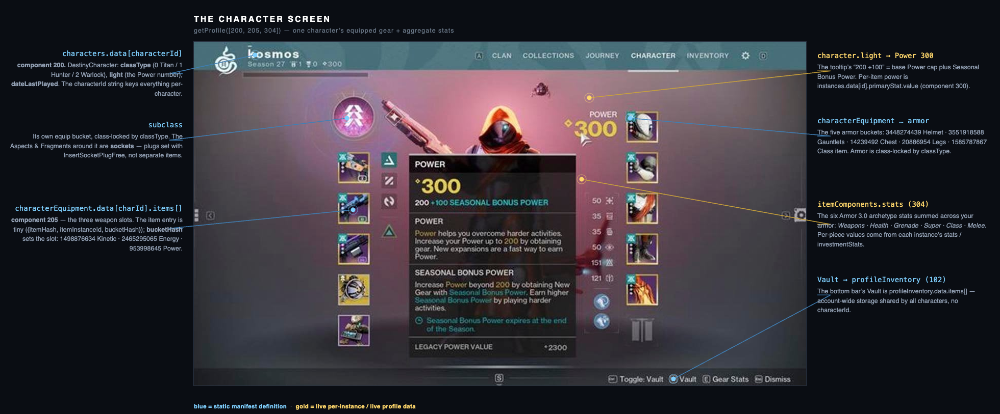
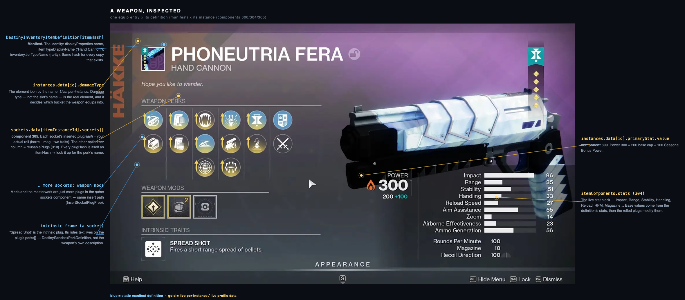
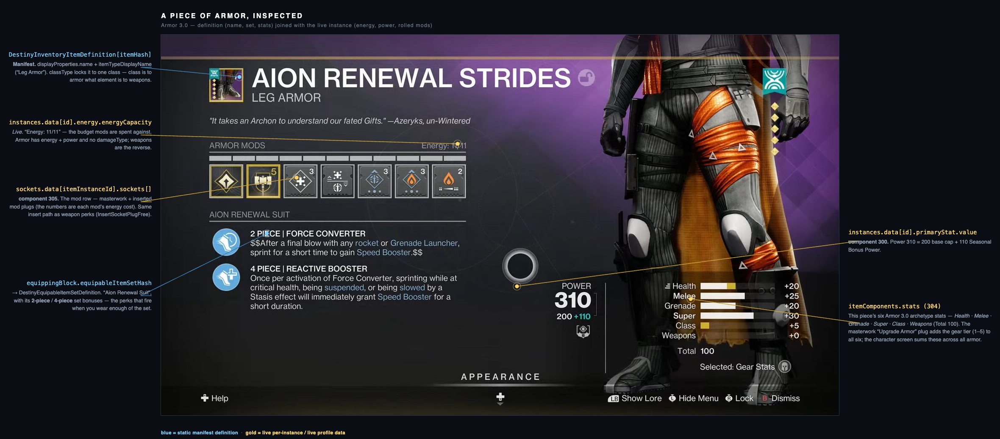

# The Bungie.net API, in one page

How Destiny 2 data is actually shaped, and how this server talks to it. Everything below is grounded in
the code under `src/bungie/` — file/symbol references are included so you can follow the wire.

## The one big idea: two data planes

Every fact about your account is assembled by joining **two completely separate sources**:

| | **Manifest** (definitions) | **Live profile** (components) |
|---|---|---|
| What it is | The static game dictionary — every item, perk, stat, bucket that *can* exist | *Your* account right now — what you own, where it is, how it's rolled |
| Keyed by | `hash` (a uint32 definition id) | `itemInstanceId` (a per-copy string id) and `characterId` |
| Where it lives | A SQLite DB Bungie ships as a versioned zip; cached at `~/.destiny2-mcp/manifest/<version>/world.sqlite` | Fetched per request from `GET /Destiny2/{type}/{membershipId}/Profile/?components=…` |
| Changes | Only when Bungie patches the game (checked every 6h, `manifest_db.ts`) | Every time you play |
| In this repo | `manifest.ts`, `manifest_db.ts` | `profile.ts` |

The manifest tells you *"hash `1363886209` is GjallarhornHorn, a Power-slot Exotic rocket launcher."*
The live profile tells you *"you own one, instance `6917529…`, it's in your Titan's Power slot, rolled
with these perks."* **Neither is useful alone.** Reading any item is always: get the live instance, then
look up its `itemHash` in the manifest to learn what it is.

```
live item  ──itemHash──▶  DestinyInventoryItemDefinition   (name, slot, rarity, icon, sockets…)
   │
   └─itemInstanceId──▶  itemComponents.instances / .sockets / .stats   (power, element, actual perks)
```

## Authentication (`client.ts`, `auth.ts`)

Every request carries two headers (`client.ts`):

- `X-API-Key: <app key>` — identifies the application. Required even for public, read-only calls.
- `Authorization: Bearer <accessToken>` — identifies *the user*. Required for anything account-specific.

OAuth is the standard authorization-code flow against `https://www.bungie.net/en/OAuth/Authorize` →
token exchange at `…/Platform/App/OAuth/token/`. Tokens land in `~/.destiny2-mcp/tokens.json`
(`accessToken`, `refreshToken`, expiries, `membershipId`). `getAccessToken()` auto-refreshes ~5 min
before expiry, so callers never think about it.

Every response is wrapped in a Bungie envelope; success is `ErrorCode === 1`, and the client throws a
`BungieError` carrying `ErrorStatus` (e.g. `DestinyItemNotFound`, `DestinyNoRoomInDestination`) on
anything else (`client.ts`).

## Identity: membership, then characters

1. **`GET /User/GetMembershipsForCurrentUser/`** → your platforms. Cross-save means one
   `membershipType`/`membershipId` pair is canonical; `getPrimaryMembership()` picks it.
2. That `{membershipType, membershipId}` addresses your **profile**.
3. A profile holds up to **3 characters** (one per class). A `DestinyCharacter` is
   `{ characterId, classType, light, dateLastPlayed }` (`profile.ts`). `classType` is an enum:
   `0 Titan · 1 Hunter · 2 Warlock`. `light` is the power level shown top-right in game.

## Components: you ask for exactly the slices you need

`getProfile([…])` takes a list of **component numbers** and returns only those branches. The ones this
server uses (`profile.ts`, `Component`):

| # | Component | Gives you |
|---|---|---|
| 102 | ProfileInventories | The **Vault** — account-wide storage (`profileInventory.data.items[]`) |
| 200 | Characters | The 3 characters and their power |
| 201 | CharacterInventories | Each character's **carried, unequipped** items |
| 202 | CharacterProgressions | Seasonal artifact, ranks |
| 205 | CharacterEquipment | What's **equipped** on each character right now |
| 206 | CharacterLoadouts | Saved in-game loadout slots |
| 300 | ItemInstances | Per-copy: `primaryStat.value` (power), `damageType`, armor `energy` |
| 301 | ItemObjectives | Quest/bounty step progress on instanced items |
| 304 | ItemStats | The stat block on an instance |
| 305 | ItemSockets | The **actual plugs** inserted in each socket (perks, mods, shaders) |
| 310 | ItemReusablePlugs | The *other* options selectable in each socket |
| 700/800/900 | PresentationNodes / Collectibles / Records | Triumphs, catalog/ownership, seals |

Components 300–310 are **per-instance**: they come back under `itemComponents`, keyed by
`itemInstanceId`, not nested inside the item entries. That's the join you do constantly — see the
worked example below.

## Where an item physically is: buckets

An item entry is tiny (`DestinyItem`, `profile.ts`):

```ts
{ itemHash: number, itemInstanceId?: string, quantity: number, bucketHash: number }
```

`bucketHash` is the **container it's sitting in right now** — and that's what decides slot/location, not
the item's definition. The buckets that matter (`manifest.ts`):

- Weapons — `1498876634` Kinetic · `2465295065` Energy · `953998645` Power
- Armor — `3448274439` Helmet · `3551918588` Gauntlets · `14239492` Chest · `20886954` Legs ·
  `1585787867` Class item
- `215593132` — **Postmaster** (Lost Items inbox). An item here can't be equipped or vaulted directly;
  its *current* bucket is the only signal it's in the inbox rather than your loadout.

Three locations, three places in the response:

- **Equipped** → `characterEquipment.data[characterId].items[]`
- **Carried, unequipped** → `characterInventories.data[characterId].items[]`
- **Vault** → `profileInventory.data.items[]` (no character — account-wide)

> **Slot is set by damage type, and the top slot's name is not an element.** The "Kinetic" bucket holds
> Kinetic, Stasis, *and* Strand weapons; a Strand weapon there still deals Strand damage. Always take
> element from the instance's `damageType` (300), never from the bucket name. (`DamageType`:
> `1 Kinetic · 2 Arc · 3 Solar · 4 Void · 6 Stasis · 7 Strand`.)

## Sockets and plugs: how rolls and cosmetics work

An item's perks, mods, masterwork, shader, and ornament are all **plugs** inserted into **sockets**.

- The **definition** (`DestinyInventoryItemDefinition.sockets.socketEntries[]`) describes the *shape*:
  how many sockets, what each can accept (a `reusablePlugSetHash`, a `randomizedPlugSetHash`, or an
  inline list).
- The **live instance** (component 305) gives `sockets[]` with the `plugHash` *actually inserted* in
  each — that's your real roll.
- Component 310 + the plug-set components (`profilePlugSets` / `characterPlugSets`) give the *other*
  options you could insert, with a `canInsert` / unlock flag. Universal ornaments and shaders live in
  these plug sets, not in 310's partial list — see `sockets.ts` for the resolution order.

Each `plugHash` is itself an `itemHash` → look it up in the manifest to get the perk's name/description.
Writing a cosmetic is `POST /Destiny2/Actions/Items/InsertSocketPlugFree/` with
`{ socketIndex, plugItemHash, itemId, characterId }`.

## The write surface

All actions are `POST /Destiny2/Actions/…` and take `membershipType` in the body:

- `…/Items/TransferItem/` — move one item character↔vault (`transferToVault` bool).
- `…/Items/EquipItems/` — equip an array of `itemIds` on a character (this is how a loadout swap is one
  call).
- `…/Items/InsertSocketPlugFree/` — insert a plug (shader/ornament/mod) into a socket.
- `…/Loadouts/UpdateLoadoutIdentifiers/` — rename/recolor a saved loadout slot.

> Transfers and plug inserts work whether or not you're in game. **Equipping requires the player to be
> live in-game** (Bungie returns error 1623 otherwise).

---

## A completed inventory, worked end to end

A trimmed real-shape response for `getProfile([200, 205, 300, 305])`, for one Titan with a few items
equipped. Note how flat the item entries are and how everything interesting lives in `itemComponents`,
joined by `itemInstanceId`.

```jsonc
{
  // ── component 200: the characters ──────────────────────────────────────────
  "characters": {
    "data": {
      "2305843009260000001": {            // ← this string IS the characterId
        "characterId": "2305843009260000001",
        "classType": 0,                   // 0 Titan · 1 Hunter · 2 Warlock
        "light": 300,                     // the big "Power 300" number in-game (200 cap + seasonal bonus)
        "dateLastPlayed": "2026-06-13T22:14:00Z"
      }
    }
  },

  // ── component 205: what's equipped on that character ───────────────────────
  // Every entry is just (hash → what it is) + (instanceId → how it's rolled) + (bucket → where).
  "characterEquipment": {
    "data": {
      "2305843009260000001": {
        "items": [
          { "itemHash": 1363886209, "itemInstanceId": "6917529111111111", "bucketHash": 953998645,  "quantity": 1 }, // Gjallarhorn → Power slot
          { "itemHash": 3325463374, "itemInstanceId": "6917529222222222", "bucketHash": 1498876634, "quantity": 1 }, // a Hand Cannon → Kinetic slot
          { "itemHash": 1591777841, "itemInstanceId": "6917529333333333", "bucketHash": 2465295065, "quantity": 1 }, // a Pulse Rifle → Energy slot
          { "itemHash":  192377242, "itemInstanceId": "6917529444444444", "bucketHash": 3448274439, "quantity": 1 }, // an Exotic helmet → Helmet slot
          { "itemHash": 2243798457, "itemInstanceId": "6917529555555555", "bucketHash": 1585787867, "quantity": 1 }  // a class item → Class slot
        ]
      }
    }
  },

  // ── component 300: per-instance live numbers, keyed by itemInstanceId ───────
  "itemComponents": {
    "instances": {
      "data": {
        "6917529222222222": { "primaryStat": { "value": 300 }, "damageType": 6 }, // Hand Cannon, power 300, Stasis (6) — note it lives in the *Kinetic* bucket!
        "6917529333333333": { "primaryStat": { "value": 298 }, "damageType": 3 }, // Pulse Rifle, Solar (3)
        "6917529444444444": { "primaryStat": { "value": 301 }, "energy": { "energyCapacity": 11 } } // armor: power + energy, no damageType
      }
    },

    // ── component 305: the ACTUAL plugs in each socket (the real roll) ─────────
    "sockets": {
      "data": {
        "6917529222222222": {
          "sockets": [
            { "plugHash": 1840239774, "isEnabled": true, "isVisible": true },  // ← barrel perk; look up 1840239774 in the manifest for its name
            { "plugHash": 1467527085, "isEnabled": true, "isVisible": true },  // ← magazine perk
            { "plugHash": 3993098925, "isEnabled": true, "isVisible": true },  // ← trait 1
            { "plugHash":  247421694, "isEnabled": true, "isVisible": true }   // ← trait 2
          ]
        }
      }
    }
  }
}
```

To render the Kinetic slot as a human would read it, the server joins:

1. `characterEquipment…items[1]` → `itemHash 3325463374`, `bucketHash 1498876634`.
2. **Manifest** lookup `DestinyInventoryItemDefinition[3325463374]` → name, icon, `itemTypeDisplayName`
   "Hand Cannon", rarity from `inventory.tierTypeName`.
3. **Instance** `instances.data["6917529222222222"]` → power `300`, `damageType 6` → **Stasis**
   (overriding the "Kinetic" bucket name — this is the rule above in action).
4. **Sockets** `sockets.data["6917529222222222"].sockets[]` → each `plugHash` → another manifest lookup
   for the perk name.

That four-way join — equip entry × definition × instance × sockets — is the whole game. Everything this
server's read tools emit (`get_equipped`, `inspect_item`, `list_inventory`) is a tight projection over
exactly that.

## See it on the screen

Three real, current (Edge of Fate / Armor 3.0, Season 27) in-game screens, each region wired to the model
name that backs it. Blue = static manifest definition; gold = live per-instance / profile data. Sources
and the regeneration scripts are in [`shots/`](./shots/README.md).

### The character screen — `getProfile([200, 205, 304])`

The equipped loadout for one character: weapon column (left), armor column + the six aggregate Armor 3.0
stats (right), subclass, power.



### A weapon, inspected — one entry × definition × instance

Identity from the manifest; element, power, the rolled perks/mods, and the live stat block from the
per-instance components (300 / 304 / 305).



### A piece of armor, inspected — Armor 3.0

The set-bonus (`equipableItemSetHash` → `DestinyEquipableItemSetDefinition`), energy budget, rolled mods,
and the six archetype stats — definition joined with the live instance.


